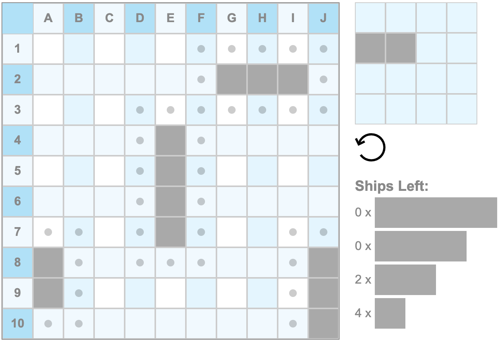

# 🛳️ Battleship Game - UI Placement Page 

### 🛠️ Overview  
This is my contribution to an **online Battleship game**, where I built the **placement page UI** using **HTML, CSS, and JavaScript**.  

## ✨ Features I Developed
✅ **Drag-and-drop ship placement**  
✅ **Grid-based board interaction**  
✅ **Responsive design with CSS styling**
✅ **Placement and boundaries validation with JS**

### 📸 Screenshot
  

🔗 **Original project repository**: [SpringBoot-Battleship](https://github.com/vishnu-narayanan-kr/SpringBoot-Battleship)
